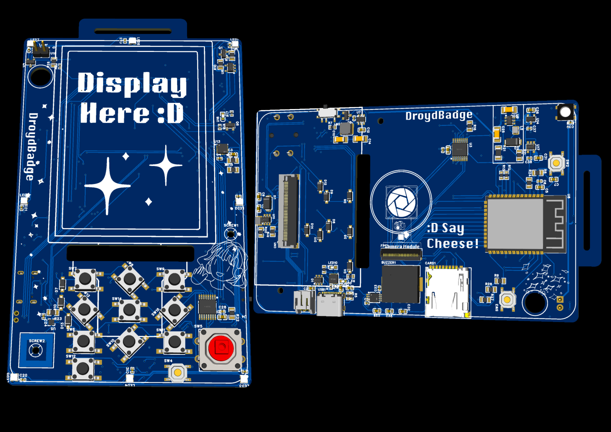
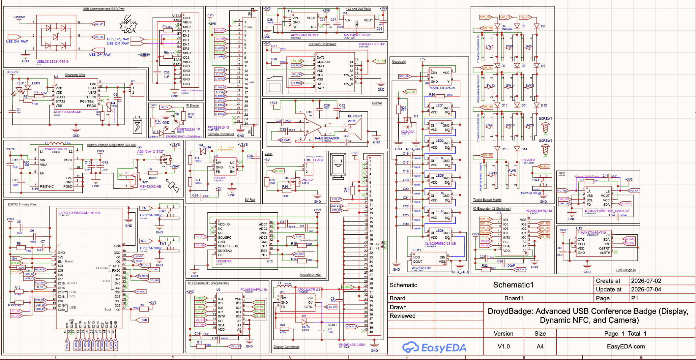

# 🎫 Dristi Badge

> A PCB hackathon badge featuring a camera, display, NFC, and thermal printer integration. Built on ESP32-S3, designed from scratch for the Outpost/Opensauce competition.

> Thank you to EasyEDA Spark for helping inspire my project, fund my PCB prototyping and supporting this endeavor. I strongly recommend it to other people looking to build new hardware.

**Key Intended Features:**
- Camera with live viewfinder
- Game mode with sprite support
- E-ink display
- NFC capability
- Thermal printer sticker output
- Rechargeable LiPo battery system
- SD card storage

---
## Board Images

  

  
  

  
  

---

## 📁 Project Structure

- **CAD/** — 3D case design files
- **Gerber_PCB/** — PCB manufacturing files (Gerber format)
- **PCB/** — KiCad project files
- **Assets/** — Documentation and reference materials

## CAD CREDITS

Display Model
https://grabcad.com/library/serial-spi-2-8-tft-lcd-module-display-320x240-optional-touch-screen-1

Camera Model
https://grabcad.com/library/ov2640-2
