# 🎫 Dristi Badge

> A PCB hackathon badge featuring a camera, display, NFC, and thermal printer integration. Built on ESP32-S3, designed from scratch for the Outpost/Opensauce competition.

**Key Features:**
- 📷 Camera with live viewfinder
- 🎮 Game mode with sprite support
- 📱 E-ink display
- 🏷️ NFC capability
- 🖨️ Thermal printer sticker output
- 🔋 Rechargeable LiPo battery system
- 💾 SD card storage

---
## Board Images

  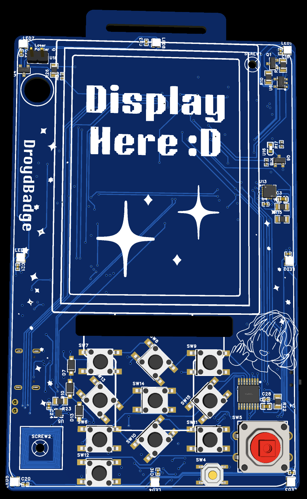
  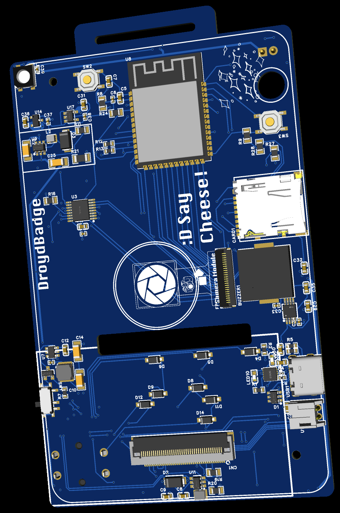

  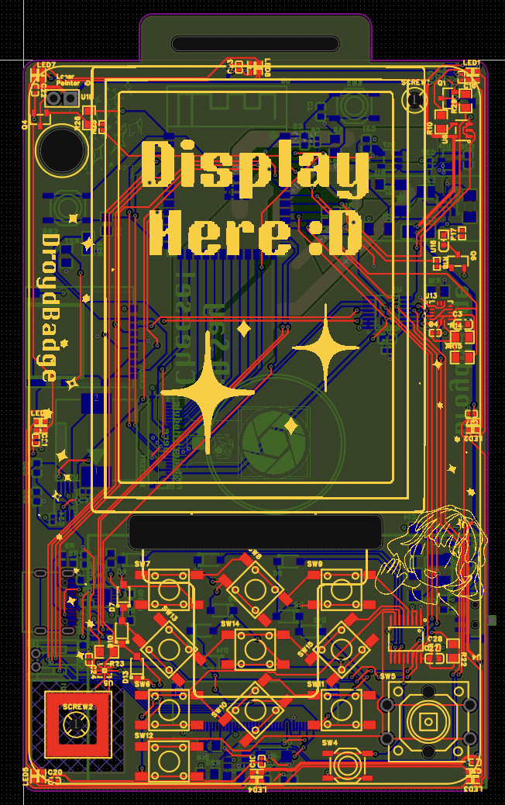
  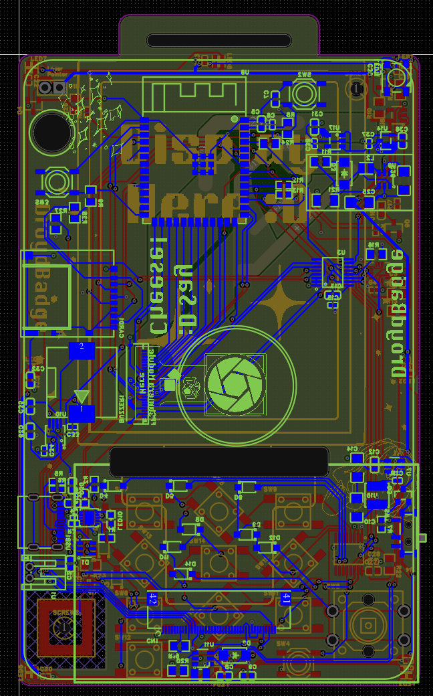

  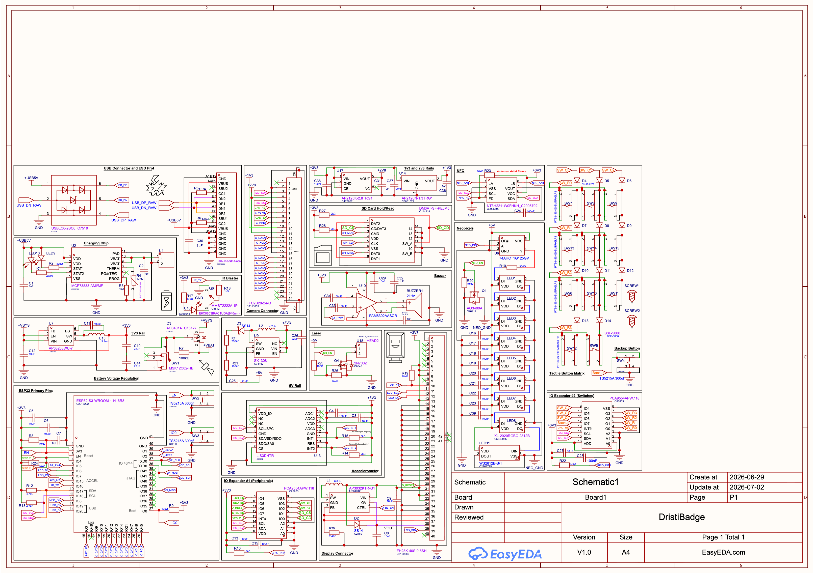
  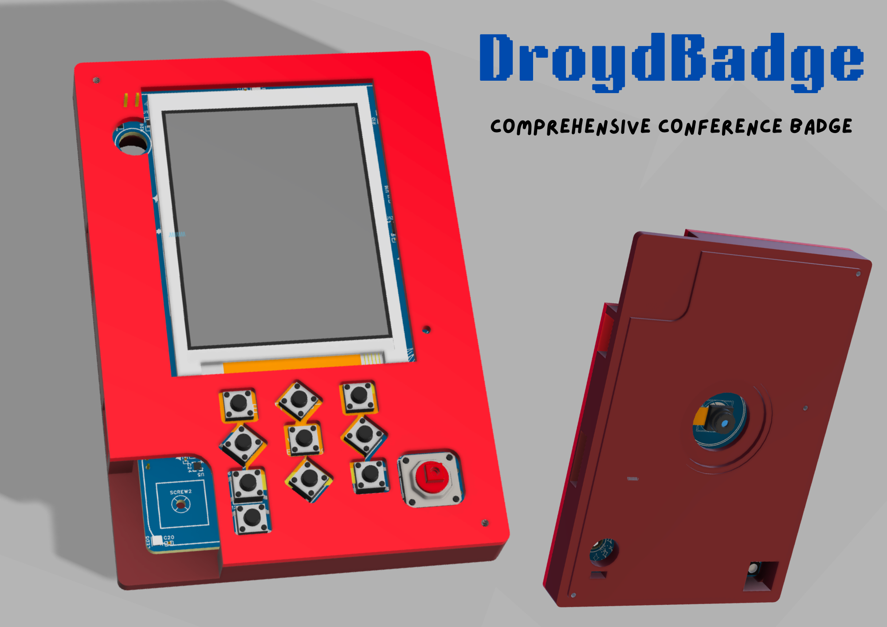

---

## Development Log

### June ≤15th — Power System & Charging

**Goal:** Establish reliable power distribution and charging infrastructure

I identified all required components and sourced them from JLCPCB for easy access and datasheet reference. My primary focus was setting up a charging system for the rechargeable LiPo battery. I designed the complete charging circuit including the charging IC, ESD protection, and USB connector.

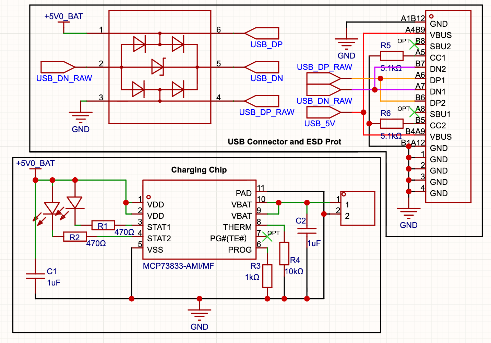
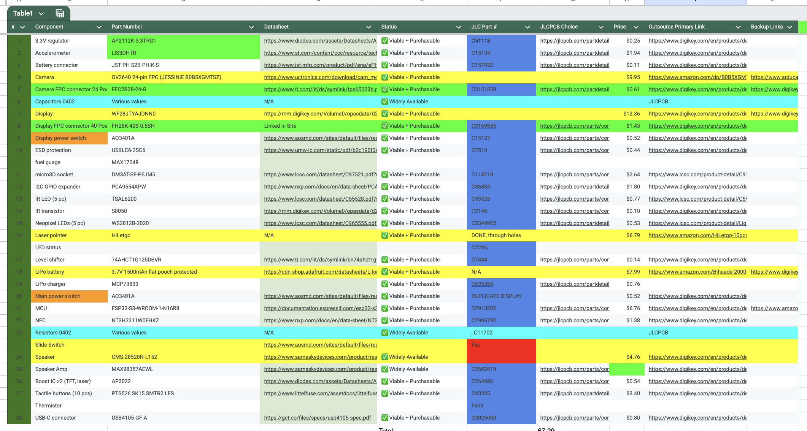

**Time Spent:** 3 hrs

---

### June 17th — Voltage Regulation & ESP32 Pinout

**Goal:** Complete power delivery and microcontroller initialization

I finalized the battery voltage regulation section and began mapping the essential ESP32 pins (power, reset, and boot). This established the foundation for the rest of the digital systems on the badge.

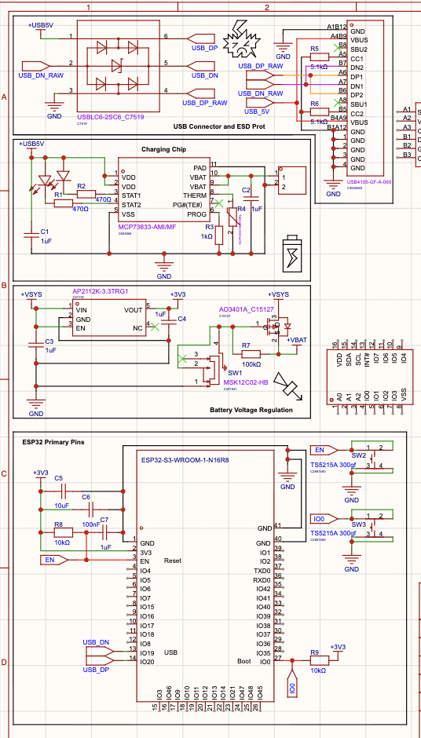

**Time Spent:** 2 hrs

---

### June 18th-19th — Sensors & I/O Expansion

**Goal:** Integrate motion sensing and expand GPIO capabilities

With the power system complete, I moved on to the peripheral modules. I wired up the accelerometer (for camera/game mode detection) and configured the primary I/O expander to handle additional I/O requirements.

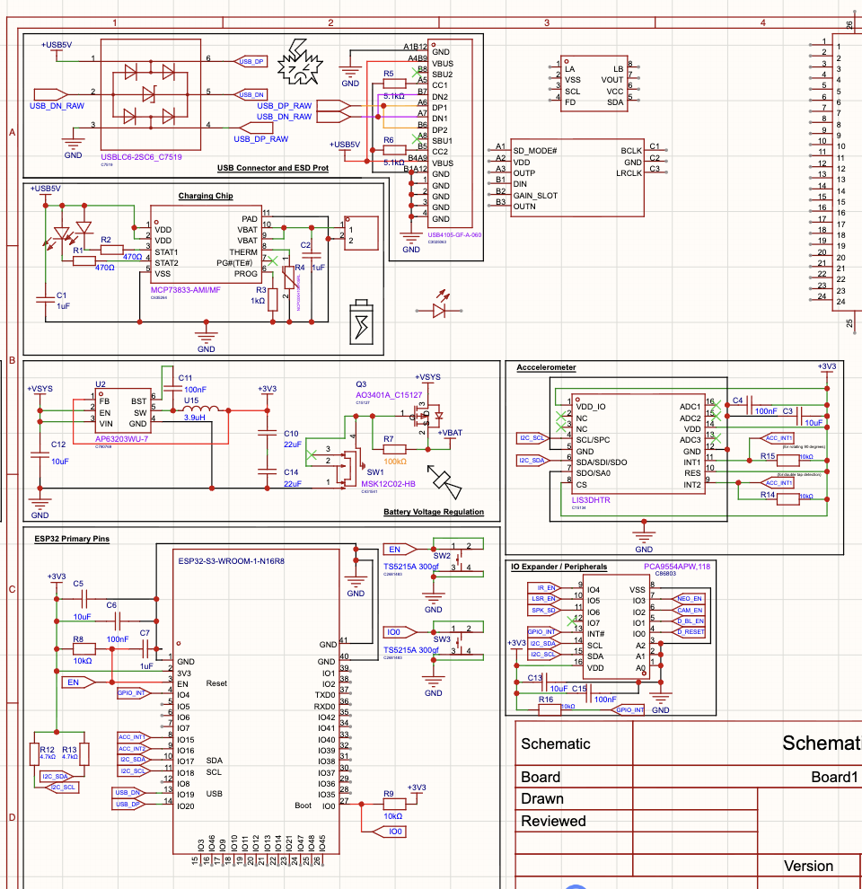

**Time Spent:** 2.2 hrs

---

### June 22nd-24th

**Goal:** IR Blaster and more ESP32 Progress

I figured out how to wire the IR Blaster correctly and I recalculated how to use my ESP32 pins so they can cover all the components (ended up needing every last one!) Then on the 23rd and 24th I successfully wired my display connector, camera connector, and created a key matrix + the nfc. The entirety of my schematic was essentially complete :D

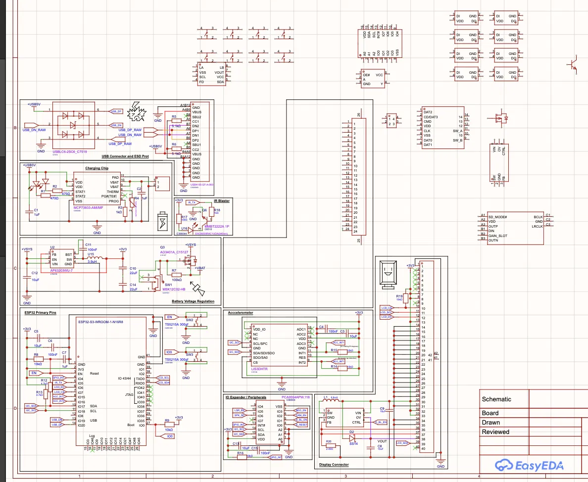

**Time Spent:** 2.2 hrs

---

### June 25th

**Goal:** Finish schematic and start PCB

I finished my schematic! I added the buzzer, some additional necessary power rails, and started placing components on the PCB editor :D. I've decided to keep my NFC, display, and keys on the front, and the esp32 and power system related components on the back.
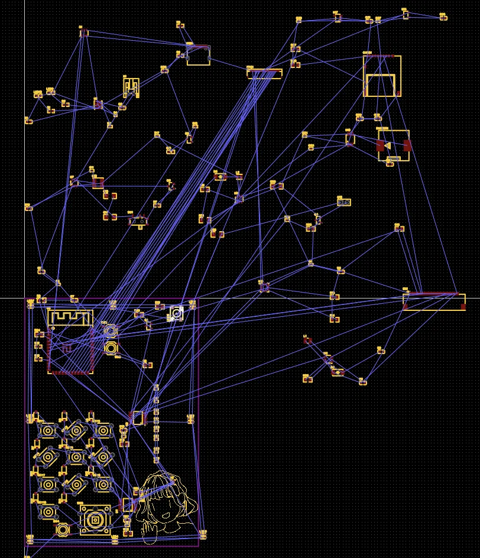

Time Spent: 9 hrs

---

### June 27th-28th

**Goal:** Continue PCB

Today I did a lot more work on placing the components in the correct locations so there's no overlap and started mapping silkscreen too. 

Time Spent: 3.75 hrs

---

### June 29th

**Goal:** Route PCB

I wired almost the entire PCB and created two extra layers for my GND and 3v3 vias to tie to. 

Time Spent: 3.67 hrs

---

### July 2nd

**Goal:** Reduce PCB shipping time/cost and strengthen power rails.

I added more copper fill regions to my second layer for +1v3 and +2v8, increased the trace width of my +5v rail, double checked my DRC and created an optional CAD case for my badge. Then I submitted it to EasyEDA Spark in order to get some funds covered and try accelerate shipping so it can arrive in time.

Time Spent: 10 hrs

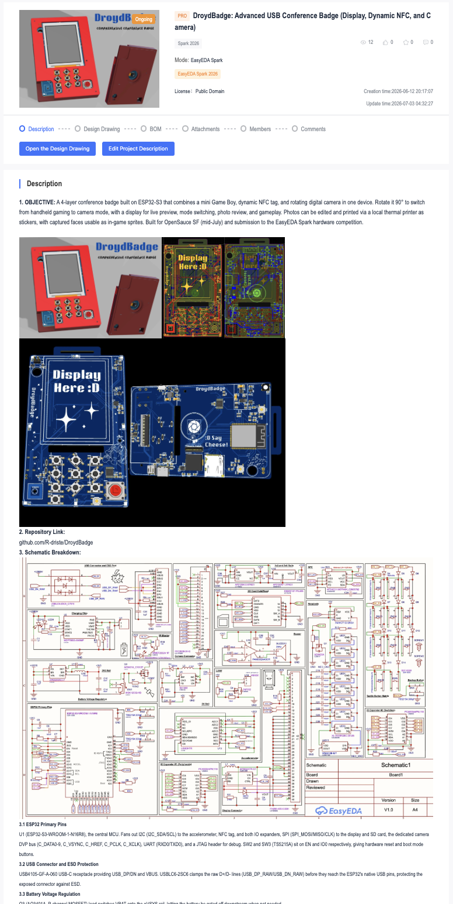

## 📁 Project Structure

- **CAD/** — 3D case design files
- **Gerber_PCB/** — PCB manufacturing files (Gerber format)
- **PCB/** — KiCad project files
- **Assets/** — Documentation and reference materials
